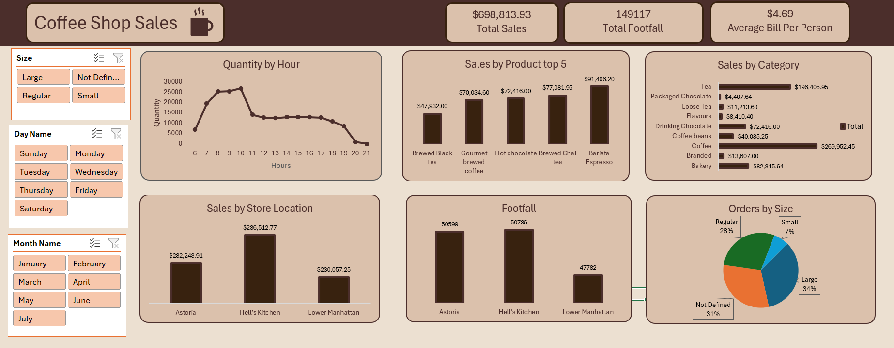

# Coffee-Shop-Sales-Project
# ☕ Coffee Shop Sales Dashboard

## 📌 Project Overview

This project presents an interactive Coffee Shop Sales Dashboard built in Microsoft Excel. The dashboard provides insights into sales performance, customer footfall, product popularity, store performance, and purchasing patterns through dynamic visualizations and filters.

The objective of this project was to transform raw transactional data into actionable business insights that can support decision-making and improve business performance.

---

## 🎯 Business Objectives

* Analyze overall sales performance.
* Identify top-selling products and categories.
* Evaluate store location performance.
* Understand customer purchasing behavior.
* Monitor customer footfall trends.
* Discover peak business hours.
* Analyze order distribution by size.

---

## 📊 Dashboard Features

### KPI Metrics

* Total Sales
* Total Footfall
* Average Bill Per Person

### Interactive Filters

* Month Name
* Day Name
* Product Size

### Visualizations

* Quantity by Hour
* Sales by Top 5 Products
* Sales by Category
* Sales by Store Location
* Customer Footfall by Store
* Orders by Size

---

## 📈 Key Insights

* Coffee generated the highest sales revenue among all product categories.
* Barista Espresso emerged as the best-performing product.
* Peak order quantities occurred during morning hours.
* Hell's Kitchen recorded the highest sales and customer footfall.
* Large-sized orders represented the largest share of purchases.
* Tea and Coffee categories contributed significantly to total revenue.

---

## 🛠 Tools & Techniques Used

* Microsoft Excel
* Pivot Tables
* Pivot Charts
* Slicers
* Data Cleaning
* Data Analysis
* Dashboard Design
* Data Visualization

---

## 📂 Project Structure

```text
Coffee-Shop-Sales-Dashboard/
│
├── Dashboard.xlsx
├── Dataset.csv
├── README.md
└── Screenshot.png
```

---

## 📸 Dashboard Preview




---

## 🚀 Skills Demonstrated

* Business Intelligence
* Data Analysis
* Dashboard Development
* Excel Reporting
* Data Visualization
* Analytical Thinking
* KPI Tracking

---

## 👨‍💻 Author

**Syed Sami Ullah**

Bachelor of Science in Computer Science

Aspiring Data Analyst | Business Intelligence Enthusiast

LinkedIn: www.linkedin.com/in/syed-sami-ullah-9232602a6

GitHub: https://github.com/SyedSamiUllah1
